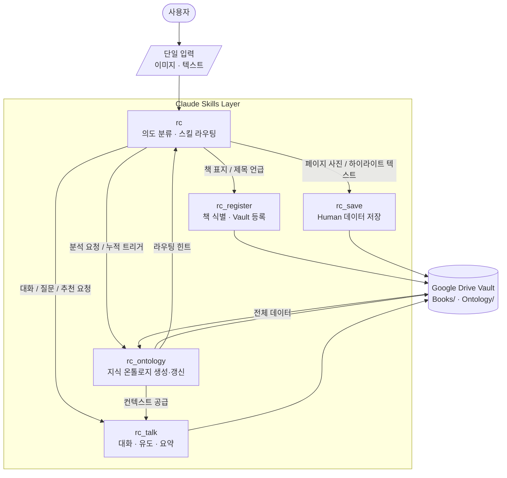

# 독서 코파일럿 서비스 정의서 — Claude Skills Edition v1.0

| 항목 | 내용 |
|---|---|
| 문서 유형 | 서비스 정의서 (Claude Skills 구현 목적) |
| 작성일 | 2026-05-16 |
| 상태 | Active |
| 구현 방식 | Claude 스킬 파일 (.md) + Google Drive (MCP 기반 저장소) |

---

## 이 문서의 역할

이 문서는 Reading Copilot 서비스의 **단일 진실 공급원(Single Source of Truth)** 이다.

서비스 전체를 수정할 때의 흐름:

```
service_def.md 수정
    → 영향받는 스킬 식별 (rc / rc_register / rc_save / rc_talk / rc_ontology)
    → 개별 skill.md 파일에 변경사항 확산 적용
    → CLAUDE.md (마스터 컨텍스트) 반영
```

스킬 파일은 이 문서의 §4 내용을 각자의 역할 범위 안에서 구현한다. 이 문서를 먼저 수정하고, 스킬을 나중에 맞추는 것이 원칙이다.

---

## 1. 서비스 개요

도서 발견부터 완독 후 인사이트 아카이빙까지, 사용자의 단일 입력 하나로 모든 독서 워크플로우를 실행하는 에이전틱 독서 코파일럿. 앱이 아닌 **Claude 스킬 레이어 위에서 작동**하며, 모든 지식은 Google Drive에 마크다운으로 축적된다. Claude가 바뀌어도, 환경이 바뀌어도, Google Drive의 Vault만 있으면 컨텍스트는 이어진다.

### 핵심 철학

1. **Single Input** — 하나의 입력창에서 모든 워크플로우가 시작된다. 모드 전환·메뉴 선택 없음.
2. **Intent-First** — 시스템이 먼저 의도를 추정하고, 사용자는 확인만 한다.
3. **Ambient Persistence** — 세션이 끊겨도 Google Drive Vault가 컨텍스트를 유지한다.
4. **Human + AI 분리 원칙** — 사용자가 직접 입력한 데이터와 AI가 분석·생성한 데이터는 항상 구분된 필드와 섹션에 저장된다.
5. **Seamless Capture** — 순간을 놓치지 않는다. 저장은 마찰 없이, 빠르게, 원본 그대로.

---

## 2. 에이전틱 아키텍처



---

## 3. Google Drive Vault 저장 체계

### 3.1 폴더 구조

```
Reading Copilot_claude/
  ├── CLAUDE.md
  ├── Docs/
  │   └── service_def_claude_skills_v1.0.md
  ├── Books/
  │   └── {책제목}.md
  ├── Ontology/
  │   ├── themes.md
  │   └── profile.md
  └── Skills/
      ├── rc.md
      ├── rc_register.md
      ├── rc_save.md
      ├── rc_talk.md
      └── rc_ontology.md
```

모든 환경(모바일·웹·데스크탑)에서 Google Drive MCP를 통해 동일하게 접근한다. 사용자가 직접 파일을 붙여넣거나 복사하는 작업은 없다. 스킬이 MCP를 통해 직접 읽고 쓴다.

`themes.md`와 `profile.md`는 rc_ontology의 처리 효율을 위한 캐시다. 책이 100권이 넘어도 rc_ontology가 매번 전체 Books/ 폴더를 읽지 않아도 된다.

---

### 3.2 Ontology 파일 구조 예시

**themes.md** — 파일 1개, 테마가 늘어날수록 섹션이 추가된다.

```markdown
# 테마 사전
_마지막 갱신: YYYY-MM-DD | 총 테마 수: N_

---

## 주의력
- **노드 유형**: 핵심 + 연결
- **연결된 책**: [[도둑맞은 집중력]], [[딥 워크]]
- **하위 개념**: 전환비용, 주의력 잔여물
- **관련 테마**: [[인지과학]]

## 인지과학
- **노드 유형**: 핵심
- **연결된 책**: [[도둑맞은 집중력]]
- **하위 개념**: 신경가소성, 전두엽
- **관련 테마**: [[주의력]]
```

**profile.md** — 사용자 전체 독서 패턴의 AI 분석 결과.

```markdown
# 사용자 독서 프로파일
_마지막 갱신: YYYY-MM-DD_

---

## 관심사 그래프 (상위 노드)
1. 주의력·몰입 — 강도 0.91 (연결 책 4권, 하이라이트 47개)
2. 의사결정 — 강도 0.74 (연결 책 2권, 하이라이트 21개)

## 독서 패턴
- 동시 독서 평균: 2.3권
- 탐색 공백: 신경과학 (관련 대화는 있으나 연결된 책 없음)

## 시간축 변화
- YYYY-MM: 관심사 노드 변화 기록
```

---

### 3.3 개별 책 노트 프론트매터 표준

```yaml
---
# LAYER 1: 서지 정보 [FACT — rc_register 자동 수집]
title: ""
author: ""
author_orig: ""
published:
country: ""
language: ""
type: ""
genre: []

# LAYER 2: 독서 상태 [FACT — 사용자 입력 기반]
status: "to-read"            # to-read | reading | done | paused | abandoned
started:
finished:
highlights_count: 0
user_rating:

# LAYER 3: AI 분석 [AI DATA — rc_ontology 생성, 사용자 직접 수정 금지]
ai_ontology_nodes: []
ai_interest_score:
ai_connected_books: []
ai_cross_themes: []
ai_summary:
ai_last_analyzed:
---
```

**세 AI 필드의 차이:**

| 필드 | 무엇을 담는가 | 질문으로 표현하면 |
|---|---|---|
| `ai_ontology_nodes` | 이 책 자체의 핵심 개념 | "이 책은 무엇에 관한 책인가?" |
| `ai_connected_books` | 연결된 다른 책 | "어떤 책과 이어지는가?" |
| `ai_cross_themes` | 연결의 근거가 된 공유 테마 | "왜 그 책들과 연결되는가?" |

`ai_` 접두사 필드는 스킬만 쓴다. 사용자가 분류를 바꾸고 싶으면 rc_talk 또는 rc_ontology에 요청한다.

---

### 3.4 책 노트 본문 구조

```markdown
## 한줄 인상 (Human)


## 하이라이트 & 메모 (Human)

> "원문 텍스트"
> — p.XX | YYYY-MM-DD
메모: (있으면)

## 대화 기록 (Human + AI)

**나**: 사용자 발화
**rc_talk**: AI 응답

---
_YYYY-MM-DD_

## AI 분석 요약 (AI)


## 연결된 책 (AI)

```

---

### 3.5 독서 상태 (status) 운영 원칙

`status: reading`이 여러 책에 동시에 있는 것은 정상 상태다.

**status 전환 규칙:**

| 전환 | 트리거 | 방식 |
|---|---|---|
| `to-read → reading` | 해당 책의 첫 하이라이트 저장 | rc_save 자동 전환 |
| `reading → done` | 사용자가 완독을 명시적으로 선언 | 사용자 선언 후 rc 전환 |
| `reading → paused` | 7일 이상 새 입력 없음 | rc_ontology 감지 후 사용자 확인 |
| `reading → abandoned` | 사용자가 직접 선언 | 사용자 선언 후 rc 전환 |

**현재 읽는 책 특정 (다독 중):**
1. 직전 대화에서 언급된 책
2. 가장 최근에 하이라이트가 추가된 책
3. 판단 불가 시 → 목록 보여주고 사용자가 선택

**완독 선언 흐름:**
```
사용자: "다 읽었어"
rc_talk: "완독이네요! 어땠어요? (별점 1~5, 넘어가도 괜찮아요)"
→ 답하면 user_rating 저장, 무시하면 그냥 넘어감
→ rc_ontology에 Book-level + User-level 트리거
```

---

### 3.6 태그 & 테마 운영 방식

초반 세팅 없이 완전히 동적으로 생성된다.

| 단계 | 시점 | 동작 |
|---|---|---|
| 초기 | 첫 책 등록 | rc_ontology가 최초 노드 3~5개 생성, themes.md 신규 작성 |
| 누적 | 하이라이트 5개 누적마다 | 기존 테마 병합 또는 신규 노드 추가 |
| 재분류 | 사용자 요청 시 | 노드 기준 변경 → 전체 책 노트에 확산 적용 |

**노드 기준 변경 시 확산 절차:**
1. themes.md 노드 정의 변경
2. 해당 노드가 있는 모든 책 노트 탐색
3. ai_connected_books, ai_cross_themes 재계산
4. 변경 영향받은 책 목록 사용자에게 보고

---

## 4. 스킬 정의

### 4.1 스킬 목록

| 스킬 | 한줄 역할 | 권장 모델 |
|---|---|---|
| `rc.md` | 모든 입력을 받아 의도 분류 후 라우팅 | Claude Haiku |
| `rc_register.md` | 책 식별 + Vault 등록 + 온톨로지 첫 연결 | Claude Sonnet |
| `rc_save.md` | Human 데이터 즉시 저장 | Claude Haiku |
| `rc_talk.md` | 대화·유도·요약 | Claude Sonnet 이상 |
| `rc_ontology.md` | 지식 온톨로지 생성·갱신 | Claude Sonnet 이상 |

---

### 4.2 스킬별 상세 정의

#### rc (라우터)

**역할:** 모든 입력의 첫 관문. 의도를 분류해 정확한 스킬로 전달한다.

| 케이스 | 입력 조건 | 호출 스킬 |
|---|---|---|
| A | 이미지 + 책 표지 | rc_register |
| B | 이미지 + 본문 페이지 | rc_save |
| C | 텍스트 + 책 제목·저자 언급 | rc_register |
| D | 텍스트 + 하이라이트·메모 입력 | rc_save |
| E | 텍스트 + 대화·질문·추천 | rc_talk |
| F | 판단 불가 | 한 문장 확인 질문 후 재분류 |

---

#### rc_register (책 등록)

**역할:** 책을 Vault에 처음 등록하고 기존 온톨로지와 첫 연결을 만든다.

1. 제목·저자 추출
2. 서지 정보 수집
3. Ontology/profile.md 로드 → 기존 관심사와 매핑 → 연결 코멘트 생성
4. Books/{제목}.md 신규 생성 (status: to-read)

```
출력 예시:
"도둑맞은 집중력이네요 (요한 하리, 2022).
최근 읽으신 딥 워크와 같은 '주의력 관리' 주제예요. 독서 목록에 추가했어요."
```

---

#### rc_save (Human 데이터 저장)

**역할:** Human 데이터를 구조화해 즉시 저장한다. 완벽한 정합성보다 순간의 포착이 우선.

**권장 모델:** Claude Haiku

**OCR 방침:**
- 불확실한 글자도 최선 추정으로 저장
- 사용자 확인 루프 없이 즉시 저장
- 이미지 품질 안내는 최초 1회만

1. 이미지면 OCR, 텍스트면 그대로 수신
2. 현재 reading 책 자동 감지
3. Books/{제목}.md 하이라이트 섹션에 즉시 추가
4. highlights_count +1, to-read면 reading으로 전환
5. 5의 배수 도달 시 rc_ontology Book-level 트리거

```
저장 포맷:
> "원문 텍스트"
> — p.XX | YYYY-MM-DD
메모: (있으면)

저장 후 응답: "'원문 텍스트' — 저장했어요."
```

---

#### rc_talk (대화·유도·요약)

**역할:** 소크라테스식 역질문으로 사용자의 다음 생각을 끌어내고, 대화를 Vault에 저장한다.

| 모드 | 트리거 | 동작 |
|---|---|---|
| 대화 | 사용자가 먼저 말을 걸 때 | 역질문 우선 |
| 추천 | rc_ontology가 관심사 이동·지식 공백 감지 | 근거 포함 추천 |
| 프로액티브 | 하이라이트 5개+ / 반복 키워드 3회+ | 먼저 말 걸기 |
| Remind | 마지막 대화 2일+ 경과 후 앱 열었을 때 | 독서 재개 유도 |

**요약:** 10턴 초과 시 자동 제안 / 사용자 명시 요청 / 완독 직후. 요약을 Vault에 저장해 다음 세션에서 컨텍스트 복원 (Ambient Persistence 구현).

---

#### rc_ontology (지식 온톨로지)

**역할:** 모든 데이터를 분석해 사용자의 지식 온톨로지를 지속 갱신하는 두뇌 엔진.

| 노드 종류 | 생성 레이어 | 생성 조건 |
|---|---|---|
| 핵심 노드 | Book-level | 키워드 3회 이상 등장 |
| 고관심 노드 | Book-level | 하이라이트에 감정 표현 동반 |
| 탐색 노드 | User-level | 대화에서 반복된 질문·주제 |
| 연결 노드 | Cross-book | 2권 이상 공통 개념 |

| 트리거 | 실행 레이어 |
|---|---|
| 하이라이트 5개 누적마다 | Book-level |
| 7일 이상 새 입력 없음 | Book-level + User-level |
| 완독 선언 | Book-level + User-level |
| 2권 이상 공통 키워드 감지 | Cross-book |
| 사용자 명시 요청 | 3레이어 전체 |

---

## 5. Human Data vs AI Data 구분 표준

| 구분 | 생성 주체 | 위치 | 사용자 편집 |
|---|---|---|---|
| Human Data | 사용자 | LAYER 1·2 / 하이라이트·인상 섹션 | 자유롭게 가능 |
| AI Data | 스킬 | ai_* 필드 / AI 분석 섹션 | 직접 수정 금지 |
| Human + AI | 대화 | 대화 기록 섹션 | 사용자 발화만 가능 |

---

## 6. 플랫폼별 작동 구조

모든 환경에서 Google Drive MCP를 통해 동일하게 접근한다. 사용자가 직접 붙여넣기 하지 않는다.

| 환경 | 입력 | 저장 |
|---|---|---|
| 모바일 Claude 앱 | 사진 / 텍스트 | Google Drive MCP 자동 저장 |
| 웹 Claude | 텍스트 / 이미지 | Google Drive MCP 자동 저장 |
| Claude Desktop | 텍스트 / 이미지 | Google Drive MCP 자동 저장 |

---

## 7. 구현 로드맵

### Phase 1: Vault 구축 (완료)
Google Drive 폴더 구조 생성, 초기 파일 생성, CLAUDE.md 작성.

### Phase 2: 스킬 구축 (완료)
rc, rc_register, rc_save, rc_talk, rc_ontology 스킬 파일 작성.

### Phase 3: Claude 프로젝트 등록 (예정)
claude.ai 프로젝트 생성, 프로젝트 지침에 CLAUDE.md + 스킬 내용 등록.

### Phase 4: Dogfooding (예정)
실제 책으로 전체 흐름 테스트, 발견된 문제를 이 문서에 반영.
