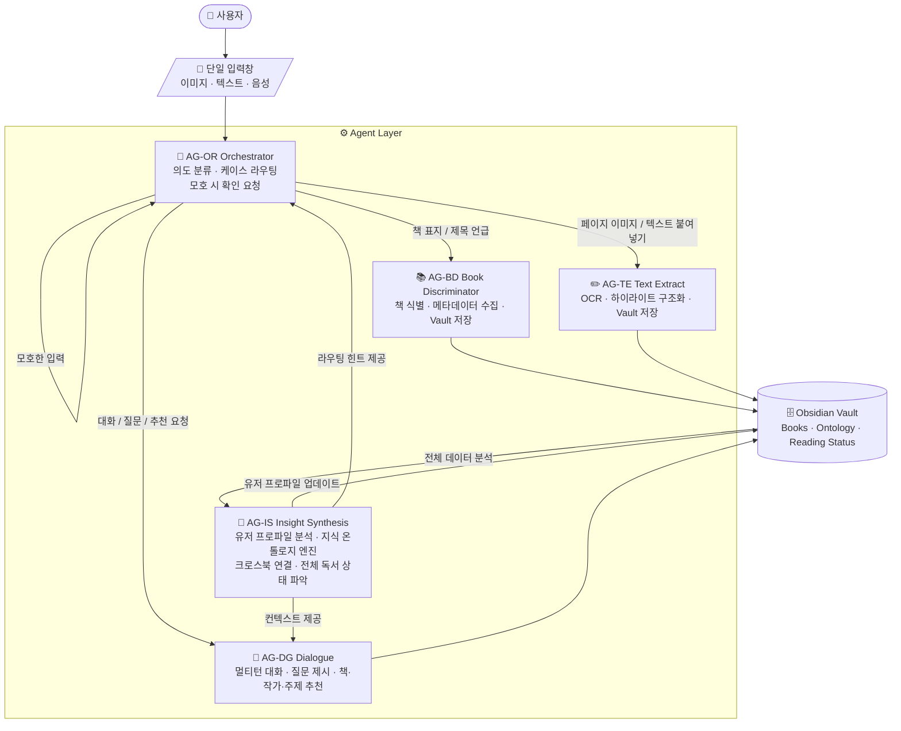

# 독서 코파일럿 서비스 정의서 (service_def)

| 항목    | 내용                                                                                                                                                         |
| ----- | ---------------------------------------------------------------------------------------------------------------------------------------------------------- |
| 문서 유형 | 서비스 정의서 (WHY / 개념)                                                                                                                                         |
| 작성일   | 2026-04-24 (v0.1) / 2026-05-05 (v0.2 patch)                                                                                                                |
| 상태    | Active (Release v0.2) — Doodle 디자인 적용에 따른 §2 ③ Ambient Persistence 명제 보정 (대화 누적 위치가 책 도메인임을 명시), §4.1 AG-OR 케이스 E 출력 귀속 룰 한 줄 추가. 핵심 철학·아키텍처는 v0.1 그대로 유지. |
| 문서 역할 | 서비스의 존재 이유, 철학, 개념적 구조를 정의한다. **기술 스택·스키마·API·화면 디테일은 이 문서에 들어가지 않는다.**                                                                                    |
| 연계 문서 | `PRD.md` (구현 명세), `design_def.md` (시각 체계), `aboutme.md` (온톨로지)                                                                                             |

---

**副題: "말하면 알아서 되는 독서 파트너"**

---

## 목차

1. [서비스 개요](#1-서비스-개요)
2. [핵심 철학](#2-핵심-철학)
3. [에이전틱 아키텍처](#3-에이전틱-아키텍처)
4. [에이전트 정의 (개념)](#4-에이전트-정의-개념)
5. [사용자 경험 시나리오](#5-사용자-경험-시나리오)
6. [데이터 철학](#6-데이터-철학)

---

## 1. 서비스 개요

### 1.1 정의

도서 발견부터 완독 후 인사이트 아카이빙까지, 사용자의 **단일 입력** 하나로 모든 독서 워크플로우를 자율 실행하는 에이전틱 독서 코파일럿. 사용자는 무엇을 입력할지, 어느 메뉴를 선택할지 고민하지 않는다. 에이전트가 의도를 파악하고, 적절한 워크플로우를 선택하며, 결과를 자동으로 구조화하여 저장한다.

### 1.2 핵심 가치 제안

- 사용자는 **입력 형식을 선택하지 않는다.** 입력만 한다. 메뉴·버튼·모드 전환이 없다.
- 에이전트가 **의도를 분류하고 실행 결과를 자동 구조화**하여 지식 저장소에 누적한다.
- 세션이 종료되어도 **컨텍스트와 독서 기록은 지속**된다.
- 단순 도구가 아닌, **사용자의 관심사·지식 수준을 학습하는 독서 파트너**로 작동한다.

---

## 2. 핵심 철학

> *"사용자의 인지 부하를 0으로 만든다. 앱은 사라지고, 대화만 남는다."*

독서 코파일럿은 아래 네 가지 원칙 위에 작동한다.

1. **Single Input, Multi-Output** — 하나의 입력창에서 모든 워크플로우가 시작된다. 입력 형태(이미지·텍스트)와 의도는 시스템이 분류한다.
2. **Intent-First** — 시스템이 먼저 의도를 추정하고, 사용자는 확인만 한다. 반대로 하지 않는다.
3. **Ambient Persistence** — 세션이 끊겨도 컨텍스트가 유지되며 대화가 이어진다. 유저는 "어디까지 했는지" 기억할 필요가 없다. **대화의 시각적 누적 위치는 책 도메인이다** — 모든 대화·하이라이트·인사이트는 해당 책 노드에 영구 누적되며, 노드를 다시 탭하면 같은 자리에 같은 컨텍스트가 다시 떠오른다 (휘발성 채팅창 부재).
4. **Proactive Partnership** — 에이전트는 수동 응답자가 아니라 **능동적 제안자**다. 유저의 흐름을 읽고 먼저 말을 건다.

---

## 3. 에이전틱 아키텍처

### 3.1 개념 다이어그램 (단일 입력 → 멀티 에이전트 라우팅)



### 3.2 에이전트 간 협력 원칙

- **진입점은 하나다.** 모든 유저 입력은 AG-OR Orchestrator를 거친다. 다른 에이전트는 유저와 직접 대화하지 않는다(단, Orchestrator가 라우팅을 완료한 후 해당 에이전트가 응답자가 된다).
- **저장은 Vault로 수렴한다.** 모든 에이전트의 산출물은 Obsidian Vault 마크다운 파일로 남는다. 중간 메모리나 외부 DB는 없다.
- **분석은 한 곳에서만 한다.** 유저 프로파일·온톨로지·크로스북 연결 분석은 AG-IS Insight Synthesis의 독점 책임이다. 다른 에이전트는 이 결과를 "소비"만 한다.
- **선제 개입은 허용되지만 강요하지 않는다.** AG-DG Dialogue가 프로액티브 메시지를 던질 수 있지만, 유저가 응답하지 않아도 흐름이 끊기지 않아야 한다.

---

## 4. 에이전트 정의 (개념)

각 에이전트는 고유 ID(`AG-*`)를 가지며, 이 ID가 PRD의 FR-ID 및 design_def의 SCR-ID와 연결된다.

### 4.1 AG-OR Orchestrator

**역할**: 사용자의 모든 랜덤 입력을 수신하는 첫 번째 관문. 입력 형태와 내용을 분석해 라우팅 케이스(A~F)로 분류하고, 해당 전문 에이전트로 전달한다. 분류 확신도가 낮을 때만 최소한의 확인 질문을 던진다.

**존재 이유**: 유저에게 "어떤 메뉴를 열 것인가"를 묻지 않기 위해. 이 에이전트가 없으면 **Intent-First 원칙이 붕괴**한다.

**라우팅 케이스 (개념)**

| 케이스 | 조건 | 라우팅 대상 | 응답 귀속 (v0.2) |
|---|---|---|---|
| A | 이미지 입력 + 책 표지로 판단 | AG-BD | 식별된 책의 SelectedSheet |
| B | 이미지 입력 + 책 본문으로 판단 | AG-TE | 현재 reading 책의 SelectedSheet |
| C | 텍스트 입력 + 책 제목/저자 언급 | AG-BD | 언급된 책의 SelectedSheet |
| D | 텍스트 입력 + 문구 직접 붙여넣기 | AG-TE | 현재 reading 책의 SelectedSheet |
| E | 텍스트 입력 + 대화/질문/추천 요청 | AG-DG | **현재 reading 책의 SelectedSheet에 자동 귀속**. reading 책 없을 시 ephemeral fade 카드(사용자가 카드 탭 시 책 선택 → 영구 SelectedSheet 승격) |
| F | 판단 불가 | 최소 확인 질문 후 재분류 | (재분류 후 결정) |

> 구체적인 판정 로직 · 확신도 임계값 · `surface` 출력 스키마는 PRD `FR-OR-*` 및 §5.1 참조.

---

### 4.2 AG-BD Book Discriminator

**역할**: 책의 존재를 '식별'하고 시스템에 등록하는 에이전트. 단순히 메타데이터를 모으는 것이 아니라, 이 책이 유저의 관심사 온톨로지에서 **어디에 위치하는지 최초 판단**한다.

**존재 이유**: 책을 등록하는 순간부터 "너의 이전 관심사와 이 책은 이렇게 연결된다"는 맥락을 제공하기 위해. 단순 카탈로그 도구와 구분되는 지점.

**개념 동작**
1. 이미지 또는 텍스트로부터 제목·저자 식별
2. 메타데이터(출판연도·카테고리·소개) 수집
3. AG-IS의 현재 유저 온톨로지와 매핑 → 연결 코멘트 생성
4. Vault에 책 등록

> 스키마 · API · 정확도 목표는 PRD `FR-BD-*` 참조.

---

### 4.3 AG-TE Text Extract

**역할**: 독서 중 생산되는 모든 텍스트 데이터(하이라이트·밑줄·메모)를 수집·구조화하는 에이전트. 이미지 OCR과 직접 텍스트 입력 모두를 처리한다.

**존재 이유**: 유저가 반응한 문구가 "어느 책의 어떤 맥락인지"를 자동으로 매칭하기 위해. 유저가 책을 지정할 필요 없이, 현재 Reading Status를 기반으로 자동 귀속시킨다.

**개념 동작**
1. 이미지 → OCR, 텍스트 → 직접 등록
2. 현재 읽는 책을 자동 감지하여 해당 책에 귀속
3. 반복 키워드·주제 패턴 감지 → AG-IS에 업데이트 신호

> OCR 정확도 · 하이라이트 구분 로직은 PRD `FR-TE-*` 참조.

---

### 4.4 AG-DG Dialogue

**역할**: AG-IS의 분석 결과를 토대로 유저와 능동적으로 상호작용하는 에이전트. 멀티턴 대화 상태를 유지하면서 **소크라테스식 문답**을 통한 독서 내재화를 지원하고, 유저의 현재 관심사·지식 수준에 맞는 질문·책·작가·주제를 선제적으로 제안한다.

**존재 이유**: 독서를 혼자 하는 행위가 아니라 "대화 가능한 파트너와 함께하는 사유"로 전환하기 위해. 프로액티브 모드가 없으면 Proactive Partnership 원칙이 붕괴한다.

**3가지 동작 모드 (개념)**

- **대화 모드**: 유저가 먼저 말을 걸 때. 역질문 우선.
- **추천 모드**: AG-IS가 "관심사 이동" 또는 "지식 공백"을 감지했을 때. 근거 포함 추천.
- **프로액티브 모드**: 하이라이트가 누적되거나 반복 패턴이 나타날 때. 열린 제안.

> 각 모드의 입력·출력·트리거 조건은 PRD `FR-DG-*` 참조.

---

### 4.5 AG-IS Insight Synthesis *(핵심 엔진)*

**역할**: 독서 코파일럿의 두뇌. 개별 책의 내용 + 유저가 생산한 하이라이트·대화·메모를 통합 분석하여 **유저의 관심사·지식 수준·독서 패턴을 지속적으로 업데이트**한다. 단순 완독 정리 도구가 아니라, 모든 에이전트에 컨텍스트를 공급하는 **상시 운용 엔진**이다.

**존재 이유**: 다른 에이전트가 "컨텍스트가 있는 상태로" 작동할 수 있게 하기 위해. 이 엔진 없이는 AG-BD의 온톨로지 코멘트도, AG-DG의 소크라테스식 문답도 깊이를 잃는다.

**3단계 분석 레이어 (개념)**

- **Book-level**: 개별 책의 핵심 개념 · 유저 반응 포인트 · 지식 수준 추정
- **User-level**: 전체 독서 이력 기반 관심사 온톨로지 그래프 · 시간축 변화 트래킹
- **Cross-book**: 책 간 개념적 연결 · 관점 차이 · 탐색 공백 영역 감지

> 트리거 조건 · 분석 깊이 조절 · 출력 스키마는 PRD `FR-IS-*` 참조.

---

## 5. 사용자 경험 시나리오

### 시나리오 A: 서점에서 책 발견
```
사용자: [책 표지 사진 드롭]

AG-OR: 케이스 A 감지 → AG-BD 라우팅

AG-BD: "『도둑맞은 집중력』이네요 (요한 하리, 2022).
        최근 읽으신 『딥 워크』와 같은 '주의력 관리' 노드예요.
        독서 목록에 추가할까요?"

사용자: 응
```

### 시나리오 B: 독서 중 하이라이트
```
사용자: [밑줄 페이지 사진 드롭]

AG-OR: 케이스 B 감지 → AG-TE 라우팅

AG-TE: "'멀티태스킹은 전환 비용을 지불하는 것' — 저장했어요.
        이 키워드, 이번 책에서 3번째로 반응하신 개념이에요.
        Insight 분석 업데이트 완료."

AG-IS: (백그라운드) 유저 온톨로지 '인지과학 > 주의력' 노드 강화
```

### 시나리오 C: 능동 추천 (프로액티브)
```
[유저 입력 없음 — AG-DG 선제 개입]

AG-DG: "최근 2주간 저장한 하이라이트 18개 중 14개가
       '주의력 · 몰입 · 디지털 환경'과 연결돼 있어요.
       이 주제를 철학적으로 파고든 『스탠딩아웃』 어떠세요?
       아니면 지금 읽는 책에 대해 얘기 나눠볼까요?"
```

### 시나리오 D: 자유 대화
```
사용자: "요즘 집중이 너무 안 돼"

AG-OR: 케이스 E → AG-DG 라우팅

AG-DG: "지금 읽으시는 책 주제가 딱 그거잖아요.
       책에서 말하는 '주의력 잔여물' 개념 — 오늘 어떤 상황에서
       가장 심하게 느끼셨어요?"
```

---

## 6. 데이터 철학

독서 코파일럿은 **유저의 개인 지식 자산은 유저의 로컬 저장소에 남는다**는 원칙을 따른다. 클라우드는 AI 처리 통로일 뿐, 데이터의 종착지가 아니다.

### 6.1 Vault-Centric Principle

모든 독서 데이터(책·하이라이트·대화·인사이트)는 **마크다운 파일**로 저장되며, 유저가 지정한 Obsidian Vault에 축적된다. 앱이 사라져도 유저의 지식은 남는다.

### 6.2 개념적 Vault 구조

```
<Vault Root>          ← 본 프로젝트는 `Reading Copilot/app_build/app/data/`로 고정
  /Books              ← 책 단위 지식 (메타·하이라이트·대화·인사이트)
  /Ontology           ← 유저 차원의 학습 상태 (프로파일·관심사 그래프·크로스북)
  /Reading_Status     ← 현재 읽는 책과 전체 이력
```

> Vault root는 일반적으로 사용자가 지정하지만, 본 프로젝트는 `Reading Copilot/app_build/app/data/` 폴더를 root로 고정한다 — 앱 디렉터리(`app_build/app/`) 하위에 클라이언트(`client/`)와 데이터(`data/`)가 형제 폴더로 공존한다 (PRD §4.7 참조). 각 파일의 정확한 포맷·스키마는 PRD `DS-*` 참조.

### 6.3 Stateless Cloud, Stateful Vault

- 클라우드 서버는 AI 처리만 담당하며 **어떤 데이터도 영속 저장하지 않는다**.
- 유저의 컨텍스트는 클라이언트가 매 요청마다 서버로 전달한다.
- 서버가 사라져도 Vault가 있으면 유저는 지식 자산을 잃지 않는다.

---

## 개정 이력

| 버전 | 일자 | 변경 요약 |
|---|---|---|
| v0.2 | 2026-05-05 | **Release v0.2 — Doodle 디자인 적용에 따른 철학 명제 보정** (Patch). §2 ③ Ambient Persistence 명제에 "대화 누적 위치가 책 도메인" 한 단락 추가 (휘발성 채팅창 부재 명시). §4.1 AG-OR 라우팅 케이스 표에 "응답 귀속" 컬럼 추가, 케이스 E 출력 귀속 룰 명시(현재 reading 책 자동 귀속, 없을 시 ephemeral). 5 에이전트의 핵심 역할·존재 이유·아키텍처는 v0.1 그대로. **이전 v1.0 → v0.1 재라벨링** (옵션 B) |
| v0.1 | 2026-04-24 | (이전 v1.0) 초기 베이스라인 — 5 에이전트(`AG-OR`/`AG-BD`/`AG-TE`/`AG-DG`/`AG-IS`) 정의, Vault-Centric 원칙, Stateless Cloud 원칙, 본 프로젝트 vault root = `Reading Copilot/app_build/app/data/` 명시. (옵션 B 라벨 통일에 따라 v1.0 → v0.1로 재라벨링) |
